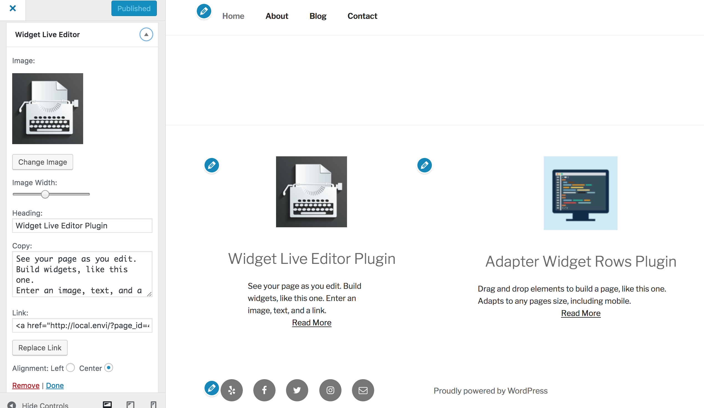
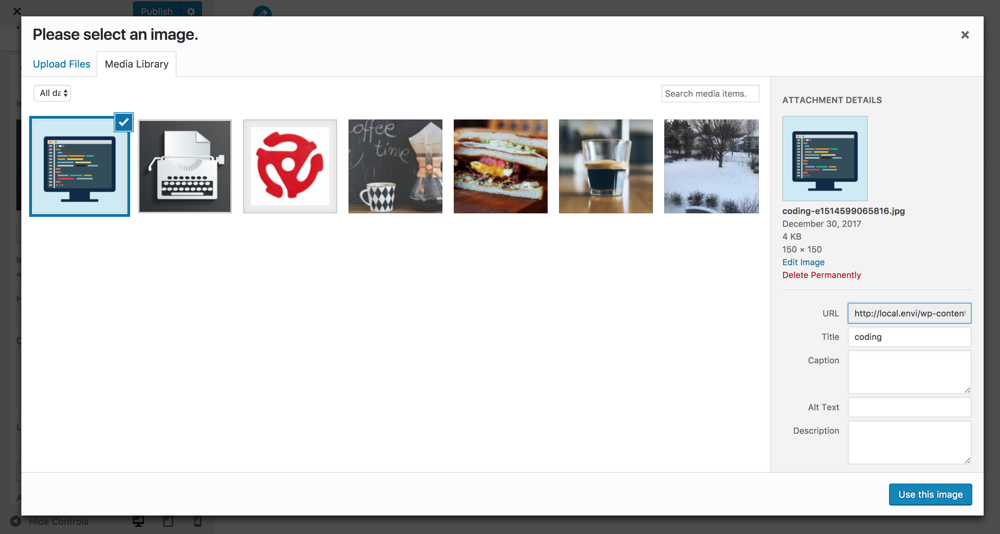
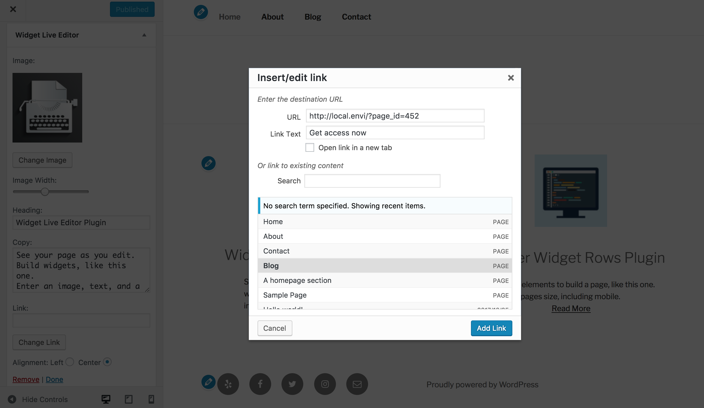

<!-- DO NOT EDIT THIS FILE; it is auto-generated from readme.txt -->
# Widget Live Editor

A flexible widget, with an image, headline, copy, and link. Resize the image, and link to any page or post.

**Contributors:** [ryankienstra](https://profiles.wordpress.org/ryankienstra)  
**Tags:** [widget](https://wordpress.org/plugins/tags/widget), [wysiwyg](https://wordpress.org/plugins/tags/wysiwyg), [live editor](https://wordpress.org/plugins/tags/live-editor), [svg](https://wordpress.org/plugins/tags/svg), [retina](https://wordpress.org/plugins/tags/retina), [responsive](https://wordpress.org/plugins/tags/responsive)  
**Requires at least:** 4.0  
**Tested up to:** 4.9.1  
**Stable tag:** 1.0.4  
**License:** [GPLv2 or later](http://www.gnu.org/licenses/gpl-2.0.html)  
**Donate link:** http://jdrf.org/get-involved/ways-to-donate/  
**Requires PHP:** 5.4  

 

## Description ##

* Easy alignment: Re-size widget images, so that you can align widgets.
* Flexible: Each widget can have an image, heading, text, and/or a link. One widget could be only an image and a link to your "Contact" page. Or only a heading, text, and a link to a blog post.
* Responsive: Looks good at any size. Perfect for Bootstrap themes, where widgets can have most of the content. Use vector images for retina displays.

## Installation ##

1. Download the plugin in /wp-admin by selecting "Plugins" > "Add New."
1. Or upload the plugin to your plugins/ directory.
1. In the "Plugins" menu, find "Widget Live Editor," and click "Activate." 
1. Click "Appearance" > "Customize."
1. Click "Widgets" > "Add a Widget."
1. Add a "Widget Live Editor" widget.
1. Select an image, enter text, and select a link.
1. Observe your widget displaying in the Customizer preview.

## Frequently Asked Questions ##

### What will change on upgrading from 1.0.3 to 1.0.4 ? ###
You will unfortunately lose your current Widget Live Editor widgets. Of course, you can create new ones, using the improved interface.

## Screenshots ##

### Select an image, add text, and choose a link.

### Selecting an image is easier.

### Link to any page or post, and enter whatever text you'd like.

## Changelog ##

### 1.0.4 ###
* Breaking changes: you will unfortunately lose all of your existing Widget Live Editor widgets.
* UI improvement: access each widget in the 'Widgets' area, instead of in a separate panel.
* Easier to select images and links for the widget.
* Option to align widget vertically.

### 1.0.3 ###
* Stability improvement: only most recent 100 posts and images available for each widget.

### 1.0.2 ###
* Fixed a bug where images were too big in Firefox and Internet Explorer.

### 1.0.1 ###
* Must have WordPress 4.0 to update.
* Editor area for widgets won't take up much of your customizer screen. They are now in their own panel.
* Sorry, "edit" links on the widgets have been removed. So have the "Move widget" and "Edit content" links. The plugin "Adapter Widget Rows" has these features, if you have Bootstrap 3.
* Easier to use when you create a new "Live Editor" widget. The page won't reload until you click.
* Compatible with WordPress 4.0.
* Translation-ready, but it doesn't have any translations.

### 1.0.0 ###
* First version

## Upgrade Notice ##

### 1.0.4 ###
This upgrade will unfortunately remove your existing Widget Live Editor widgets.
Please upgrade if you'd like to take advantage of the improved image and link selection, but you're willing to add the widgets again.

### 1.0.3 ###
Must have at least WordPress 4.0 to update. Stability fix. Compatible with WordPress 4.1.

### 1.0.2 ###
Must have WordPress at least 4.0 to update.
Bug fix for image size in Internet Explorer and Firefox.

### 1.0.1 ###
Must have WordPress 4.0 to update.
Keeps the edit area of the "Live Editor" widgets out of the way.
Translation-ready, but no translations included.

